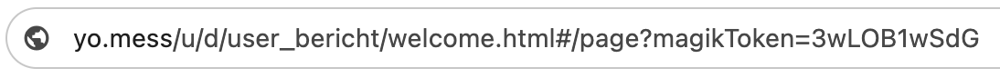

class: middle center

.small[⏳ Loading...]

---

## 👋 Hola

.left-column-66[

#### Lorenzo Peña

- 14 years of Python + Django
- Organizer of Python Pizza Holguín 2020
- Backend Engineer at Alasco

]

.right-column-33[]

---

 
 

# How does this URL make you feel?

--

.large[.right[😶 😬 🙄 😑 🤨 😧]]

---

class: middle center

---

class: middle center

# pizza:// .theme[.big[Who cares about URLs]] .py

---

 

.left-column-33[]

--

.right-column-66[

When you change a URI on your server, you can never completely tell who will have links to the old URI [...] They might have bookmarked your page. They might have scrawled the URI in the margin of a letter to a friend.

.right[.theme[Cool URIs don't change, 1998]]

]

.right-column-66[.right[]]

---

class: middle center

# .big[design URLs]

--

name: design

it's our job

---

class: middle center

.large[.huge[🫠]]

---

## Five friends

--

> > > .code[.green[.big[302_FOUND]]]

> > > .code[.green[.big[301_MOVED_PERMANENTLY]]]

--

> > > .code[.green[.big[307_TEMPORARY_REDIRECT]]]

> > > .code[.green[.big[308_TEMPORARY_REDIRECT]]]

--

> > > .code[.green[.big[309_REPLACE_USER_BOOKMARKS]]]

---

## .strike[Five] Four friends

> > > .code[.green[.big[302_FOUND]]]

> > > .code[.green[.big[301_MOVED_PERMANENTLY]]]

> > > .code[.green[.big[307_TEMPORARY_REDIRECT]]]

> > > .code[.green[.big[308_TEMPORARY_REDIRECT]]]

> > > .strike[.code[.green[.big[309_REPLACE_USER_BOOKMARKS]]]] 😢

---

template: design

---

## Inteligible

- Make them readable
- Make them memorable

---

## Predictable

- Structureed, hierarchical
- I should be able to guess-navigate your site by rewriting URLs

---

## Concise

- Straight to the point
- No redundancies
- Do you really need all those query params?

---

## Consistent

- Camels, snakes or kebaps... just pick one
- Trailing slash or not... just pick one
- .html .php .aspx or nothing... just pick one

---

class: middle center

# .big[design URLs]

--

.green[77,8% of my followers will thank you!]

---

## Where to find me?

.left-column-66[

|           |                                                    |
| --------- | -------------------------------------------------- |
| X/Twitter | [@lorinkoz](https://x.com/lorinkoz)                |
| GitHub    | [github.com/lorinkoz](https://github.com/lorinkoz) |
| Email     | [lorinkoz@gmail.com](mailto:lorinkoz@gmail.com)    |

 

.right[Slides are here 👉]
.right[.small[(and you should never get a 404 from this link)]]
]

.right-column-33[

 

]
